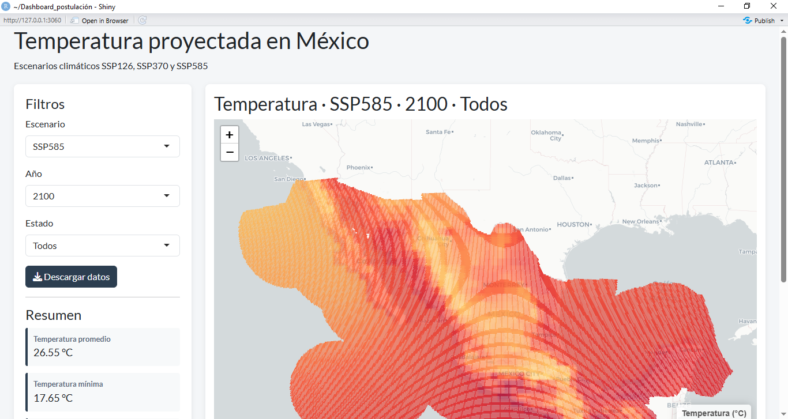

# Dashboard de Temperatura Proyectada en México
# Dashboard de Temperatura Proyectada en México


Aplicación desarrollada en **R Shiny** para visualizar proyecciones de temperatura en México sobre una malla hexagonal de 10 km.

El dashboard permite explorar diferentes escenarios de cambio climático mediante un mapa interactivo, con filtros por escenario, año y estado.

## Funcionalidades

- Visualización interactiva mediante Leaflet.
- Filtros por escenario climático (SSP126, SSP370 y SSP585).
- Filtros por año (2020, 2050, 2070 y 2100).
- Filtro por estado.
- Resumen estadístico de la información visualizada.
- Descarga de los datos filtrados en formato CSV.


## Estructura del proyecto

```
Dashboard_postulación/

├── app.R
├── Datos/
│   ├── malla_hex_10km.gpkg
│   ├── temperatura_2020_ssp126.xlsx
│   ├── temperatura_2020_ssp370.xlsx
│   ├── temperatura_2020_ssp585.xlsx
│   ├── temperatura_2050_ssp126.xlsx
│   ├── temperatura_2050_ssp370.xlsx
│   ├── temperatura_2050_ssp585.xlsx
│   ├── temperatura_2070_ssp126.xlsx
│   ├── temperatura_2070_ssp370.xlsx
│   ├── temperatura_2070_ssp585.xlsx
│   ├── temperatura_2100_ssp126.xlsx
│   ├── temperatura_2100_ssp370.xlsx
│   └── temperatura_2100_ssp585.xlsx
├── .gitignore
└── .gitattributes
```

---

## Fuente de datos

El dashboard utiliza una malla hexagonal de 10 km y archivos de temperatura proyectada correspondientes a los escenarios climáticos SSP126, SSP370 y SSP585 para los años 2020, 2050, 2070 y 2100.

---

## Ejecución

Instalar las dependencias necesarias:

```r
install.packages(c(
  "shiny",
  "sf",
  "leaflet",
  "dplyr",
  "readxl",
  "viridis",
  "bslib"
))
```

Posteriormente ejecutar:

```r
shiny::runApp()
```

---

## Autor

**Jereemy Alan Rugerio Toledo**

Ingeniero Petrolero  
Universidad Nacional Autónoma de México (UNAM)
